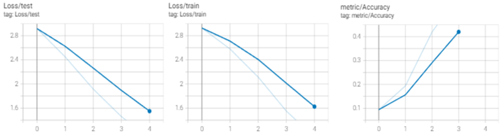

# Tentamen ML2022-2023

De opdracht is om de audio van 10 cijfers, uitgesproken door zowel mannen als vrouwen, te classificeren. De dataset bevat timeseries met een wisselende lengte.

In [references/documentation.html](references/documentation.html) lees je o.a. dat elke timestep 13 features heeft.
Jouw junior collega heeft een neuraal netwerk gebouwd, maar het lukt hem niet om de accuracy boven de 67% te krijgen. Aangezien jij de cursus Machine Learning bijna succesvol hebt afgerond hoopt hij dat jij een paar betere ideeen hebt.

## Vraag 1

### 1a
In `dev/scripts` vind je de file `01_model_design.py`.
Het model in deze file heeft in de eerste hidden layer 100 units, in de tweede layer 10 units, dit heeft jouw collega ergens op stack overflow gevonden en hij had gelezen dat dit een goed model zou zijn.
De dropout staat op 0.5, hij heeft in een blog gelezen dat dit de beste settings voor dropout zou zijn.

- Wat vind je van de architectuur die hij heeft uitgekozen (een Neuraal netwerk met drie Linear layers)? Wat zijn sterke en zwakke kanten van een model als dit in het algemeen? En voor dit specifieke probleem?
- Wat vind je van de keuzes die hij heeft gemaakt in de LinearConfig voor het aantal units ten opzichte van de data? En van de dropout?

### Antwoord 1a
Het is een eenvoudige architectuur die over het algemeen makkelijk op te zetten is en eenvoudig is te trainen en daarom makkelijk in te zetten is als baseline model. Tevens kan deze snel en eenvoudig handmatig getuned worden en is het risico op overfitten klein. In het algemeen is het nadeel dat dit model generalistisch is, er zijn inmiddels veel betere modellen die specifiek voor bepaalde data en problemen ontwikkeld zijn. Deze zullen beter getraind kunnen worden met een hogere accuracy. Dit specifieke probleem is daar een goed voorbeeld van. Het gekozen model is niet optimaal voor het probleem wat we hier willen oplossen, namelijk een classificatie probleem op sequential data. Een RNN zou hier beter voor geschikt zijn aangezien een RRN informatie van eerder uit de sequence kan onthouden, het model zoals nu ontwikkeld kan dit niet en kan daardoor belangrijke verbanden missen. 
Daarnaast vind ik de stap van 13 input features, naar 100 units en vervolgens 10 units met een output van 20 niet helemaal logisch. Het lijken vrij grote stappen, wellicht kan er een betere score behaald worden wanneer we nog 1 laag toevoegen en van 13 input features eerst naar een hidden layer van 64, en vervolgens 128 gaan. De output staat op 20 wat zou betekenen dat we 20 classes moeten kunnen classificeren (getal [10] en geslacht [2]). Ik zou de consultant adviseren dit ter verificatie met de business af te stemmen, zoals de vraagstelling nu namelijk is geformuleerd zou de definitie ook kunnen zijn dat we enkel opzoek zijn naar het getal, in dat geval zal de output dus niet op 20 maar op 10 moeten staan. Voor de verdere uitwerking houd ik 20 classes aan.
De dropout kun je verhogen wanneer je ziet dat je model gaat overfitten. De dropout van 0.5 (50%) is voor deze data echter aan de hoge kant. Een dropout van 0.2 (met de units in de LinearConfig zoals initieel in het model staan) laat al een betere accuracy zien zonder dat er sprake lijkt te zijn van overfitting (van de hierboven vermelde 67% gaat het model  79% bij een dropout van 0.2, zie figuur 1).

<figure>
  

    
    <figcaption align="center">
      <i> Fig 1.Verlagen van de dropout rate</i>
    </figcaption>
  

</figure>

## 1b
Als je in de forward methode van het Linear model kijkt (in `tentamen/model.py`) dan kun je zien dat het eerste dat hij doet `x.mean(dim=1)` is. 

- Wat is het effect hiervan? Welk probleem probeert hij hier op te lossen? (maw, wat gaat er fout als hij dit niet doet?)
- Hoe had hij dit ook kunnen oplossen?
- Wat zijn voor een nadelen van de verschillende manieren om deze stap te doen?

### Antwoord 1b
De forward functie zorgt ervoor dat de input data door het netwerk kan gaan, getraind kan worden en in de juiste directie door het model stroomt. Iedere laag in het netwerk accepteert door de forward methode input data, voert hier transformaties zoals in het model gedefinieerd op uit en voed de output in een volgende laag. De eerste stap die de consultant hier gedaan heeft met x.mean(dim=1) is ervoor om te zorgen dat het aantal dimensies overeenkomt met de input die het model in dit geval nodig. 
De consultant had dit ook kunnen oplossen door bijvoorbeeld Flatten, Average Pooling of Max Pooling te gebruiken.
Het nadeel van de nu gemaakte keuze is dat er waarschijnlijk belangrijke informatie verdwijnt. Average en max pooling worden vooral gebruikt bij images waarbij het aantal dimensies verkleint wordt door het gemiddelde (dimensie vloeiend maken, lijkt eigenlijk op hetgeen de consultant nu ook gedaan heeft) of het maximale (de hoogste waarde) mee te nemen, het nadeel van deze is dat we door gemiddelde detail informatie verliezen. Een Flatten is eenvoudig echter is het risico op overfitten groter. Door met een dropout te werken zal dit echter goed gemanaged kunnen worden.

### 1c
Omdat jij de cursus Machine Learning hebt gevolgd kun jij hem uitstekend uitleggen wat een betere architectuur zou zijn.

- Beschrijf de architecturen die je kunt overwegen voor een probleem als dit. Het is voldoende als je beschrijft welke layers in welke combinaties je zou kunnen gebruiken.
- Geef vervolgens een indicatie en motivatie voor het aantal units/filters/kernelsize etc voor elke laag die je gebruikt, en hoe je omgaat met overgangen (bv van 3 naar 2 dimensies). Een indicatie is bijvoorbeeld een educated guess voor een aantal units, plus een boven en ondergrens voor het aantal units. Met een motivatie laat je zien dat jouw keuze niet een random selectie is, maar dat je 1) andere problemen hebt gezien en dit probleem daartegen kunt afzetten en 2) een besef hebt van de consquenties van het kiezen van een range.
- Geef aan wat jij verwacht dat de meest veelbelovende architectuur is, en waarom (opnieuw, laat zien dat je niet random getallen noemt, of keuzes maakt, maar dat jij je keuze baseert op ervaring die je hebt opgedaan met andere problemen).

### Antwoord 1c
Zoals in1A omschreven zou een RNN beter bij dit probleem passen. Het verleden in de sequence geeft namelijk belangrijke context. Het probleem van een base RNN is echter dat deze niet in staat is  om keuzes te maken in hetgeen hij onthoud. Dit zorgt ervoor dat ook overbodige en niet relevante informatie doorgegeven wordt in de hidden layers en kan efficiënter met een LSTM of GRU waarbij LSTM de meeste complexiteit kent. Een LSTM of GRU leert dus wanneer die weer zaken moet vergeten of juist onthouden d.m.v. gates. Voor deze data en dit specifieke probleem zou een GRU moeten volstaan. Onderstaande GRU architectuur zou daar bij kunnen passen:
-	Input = 13 (dit zijn het aantal features)
-	Output = 20 (dit zijn het aantal classes als ik de aanname zoals beschreven in 1A aanhoud)
-	Hidden Layers = 64 (dit is een educated guess en startpunt voor de ondergrens en zal tijdens experimenten opgehoogd worden)
-	Layers = 2 tot waarschijnlijk 4 (een goede methode om het aantal layers te bepalen is simpelweg experimenteren tot ik zie dat het model gaat overfitten. Afhankelijk van de resultaten kan ik de dropout verhogen of besluiten om geen extra layers meer toe te voegen) 
-	Dropout = 0.2 (ook een educated guess en op basis van een eerder experiment op het model van de junior consultant waarbij we al zagen dat 0.5 te hoog is in dit geval)
-	In de forward methode neem ik d.m.v. X[:-1:] de laatste output mee (last step)
-	Ik gebruik CrossEntropy loss omdat we hier een classificatie probleem hebben
-	De optimizer ADAM met LR 1-3 bleek tijdens de lessen en oefeningen vaak het beste te werken en laat ik dus zo staan.

Eventueel zou er ook nog gekeken kunnen worden naar een attention architectuur of een combinatie van GRU en attention. Dat lijkt in dit geval echter overkill omdat onze data niet uit lange zinnen bestaat. Daarnaast kom ik ook tegen dat een Conv2D bij dit classificatie probleem een goed alternatief kan zijn. Het model zal dan gaan kijken naar afbeeldingen van de zogenaamde MEL frequencies. Mijn kennis is echter onvoldoende om vanuit deze data deze frequenties te plotten. Ik ga in de volgende stappen dus aan de slag met een GRU model zoals we die ook tijdens de lessen behandeld hebben en ben er voorstander van om kritisch te kijken naar de afweging tussen complexiteit en resultaat (keep it simple)!

### 1d
Implementeer jouw veelbelovende model: 

- Maak in `model.py` een nieuw nn.Module met jouw architectuur
- Maak in `settings.py` een nieuwe config voor jouw model
- Train het model met enkele educated guesses van parameters. 
- Rapporteer je bevindingen. Ga hier niet te uitgebreid hypertunen (dat is vraag 2), maar rapporteer (met een afbeelding in `antwoorden/img` die je linkt naar jouw .md antwoord) voor bijvoorbeeld drie verschillende parametersets hoe de train/test loss curve verloopt.
- reflecteer op deze eerste verkenning van je model. Wat valt op, wat vind je interessant, wat had je niet verwacht, welk inzicht neem je mee naar de hypertuning.

### Antwoord 1d
De logica achter het grove experimenteer werk bestaat uit 4 experimenten. Hierbij ga ik in experiment 1 en 2 aanpassingen doen in de hidden size. Experiment 3 zal o.b.v. de beste resultaten kijken naar het aantal layers en ten slotte ben ik van plan 1 of meerdere experimenten uit te voeren op de dropout rate. De optimizer en learning rate pas ik niet aan in deze experimenten aangezien deze combinatie tijdens lessen en oefeningen goed bleek te werken en omdat ik bovendien de verwachting heb dat de bedachte architectuur goed zal presteren.

Het experiment op het geïmplementeerde GRU model is uiteindelijk als volgt uitgevoerd, waarbij input en output niet gewijzigd worden en waarbij het aantal Epochs tot 5 is beperkt zodat we snel de effecten kunnen zien:
- Exp 1: Hidden size = 64, layers = 2, dropout = 0.2
- Exp 2: Hidden size = 100, layers = 2, dropout = 0.2
- Exp 3: Hidden size = 100, layers = 4, dropout = 0.2
- Het idee van experiment 4 (dropout aanpassen) heb ik uiteindelijk anders aangepakt. Aangezien ik na 5 epochs geen aanleiding zag uit de eerdere experimenten om de dropout aan te passen heb ik voor experiment 4 eerst het aantal epochs verhoogd om vervolgens te kunnen beoordelen of er iets met de dropout gedaan moet worden.

#### <b><i>Resultaten: </b></i>

- <u>Exp 1 (<i>Fig 2) </i>: </u> Na 5 epochs haalt de architectuur een accuracy van 47%, een goede baseline om vanuit deze architectuur verder te experimenteren.
<figure>
  

    
    <figcaption align="left">
      <i> Fig 2. Exp 1</i>
    </figcaption>
  

</figure>

- <u>Exp 2 (<i>Fig 3) </i>: </u> Na 5 epochs haalt de architectuur een accuracy van 67% en laat het een goede leercurve zien. Ik concludeer dat een hidden size van 100 betere resultaten geeft en dat de dropout van 0.2 voor nu nog prima is
<figure>
  

    
    <figcaption align="left">
      <i> Fig 3. Exp 2</i>
    </figcaption>
  

</figure>

- <u>Exp 3 (<i>Fig 4 & 5) </i>: </u> In de test zie ik dat de loss afzwakt in momentum, dit was ook te verwachten omdat de dropout nog op 0.2 staat. Wat echter vreemd is is dat ik ook op de trainset zie dat de accuracy lager blijft na 5 epochs (vergeleken met exp 2). Ik vermoed echter dat dit te verklaren is door de 1ste epoch die random iets hoger uitkwam bij experiment 2. Figuur 5 laat daarom ditzelfde experiment nogmaals zien, hierbij komt de accuracy op 71% uit.
<figure>
  

    
    <figcaption align="left">
      <i> Fig 4. Exp 3 & 2 (Exp2=blauw, Exp3=rood)</i>
    </figcaption>
  

</figure>

<figure>
  

    
    <figcaption align="left">
      <i> Fig 5. Exp 3, 2de run</i>
    </figcaption>
  

</figure>

- <u>Exp 4 (<i>Fig 6) </i>: </u> Aangezien de leercurve er op train en test data goed uitziet is voor dit experiment het aantal epochs verhoogd van 5 naar 15 met de instellingen uit voorgaande experiment. Als eerste is dit experiment gedraaid met de dropout van 0.2 zodat bepaald kan worden of de dropout verder verlaagd kan worden of juist naar boven moet worden bijgesteld.
<figure>
  

    
    <figcaption align="left">
      <i> Fig 6. Exp 4</i>
    </figcaption>
  

</figure>
De dropout zou iets opgehoogd kunnen worden. Echter, na 15 epochs zit dit model al op 93%.
Handmatig verder experimenteren lijkt me dan ook niet meer nodig en bovenstaande experimenten zouden voldoende handvaten moeten geven om te kunnen hypertunen, en om een niet al te grote search base te definiëren. Onderstaande figuur laat bovenstaande resultaten naast elkaar zien

<figure>
  

    
    <figcaption align="center">
      <i> Fig 7.Experimenten op GRU architectuur</i>
    </figcaption>
  

</figure>

## Vraag 2
Een andere collega heeft alvast een hypertuning opgezet in `dev/scripts/02_tune.py`.

### 2a
Implementeer de hypertuning voor jouw architectuur:
- zorg dat je model geschikt is voor hypertuning
- je mag je model nog wat aanpassen, als vraag 1d daar aanleiding toe geeft. Als je in 1d een ander model gebruikt dan hier, geef je model dan een andere naam zodat ik ze naast elkaar kan zien.
- Stel dat je de dataloader wil/moet aanpassen, dat mag ook.
- voeg jouw model in op de juiste plek in de `tune.py` file.
- maak een zoekruimte aan met behulp van pydantic (naar het voorbeeld van LinearSearchSpace), maar pas het aan voor jouw model.
- Licht je keuzes toe: wat hypertune je, en wat niet? Waarom? En in welke ranges zoek je, en waarom? Zie ook de [docs van ray over search space](https://docs.ray.io/en/latest/tune/api_docs/search_space.html#tune-sample-docs) en voor [rondom search algoritmes](https://docs.ray.io/en/latest/tune/api_docs/suggestion.html#bohb-tune-search-bohb-tunebohb) voor meer opties en voorbeelden.

### Antwoord 2a:
Met de kennis van bovenstaande experimenten stel ik onderstaande search base samen voor een eerste test met de hypertuner:
-	Hidden size tussen 85 en 100 (bij 100 zijn de prestaties al zeer goed zoals bleek uit de experimenten)
-	Tussen de 2 en 4 layers. Bij 2 layers waren de resultaten na 5 epochs al beter dan de architectuur van de junior consultant. Deze houden we dus als minimum aan. In de experimenten zie ik goede resultaten bij 4 layers en daarom houd ik dit als bovengrens aan.
-	Dropout tussen de 0.2 en 0.4. Ik verwacht dat 0.4 al aan de hoge kant is maar via de hypertuner kan dit eenvoudig geanalyseerd worden. 
-	Om te zorgen dat de hypertuner tijdens deze eerste run niet teveel tijd in beslag neemt stel ik het aantal epochs laag in op 2. Op deze manier krijg ik iets meer gevoel van hetgeen de hypertuner doet zonder dat het al te veel tijd in beslag gaat nemen.

### 2b
- Analyseer de resultaten van jouw hypertuning; visualiseer de parameters van jouw hypertuning en sla het resultaat van die visualisatie op in `reports/img`. Suggesties: `parallel_coordinates` kan handig zijn, maar een goed gekozen histogram of scatterplot met goede kleuren is in sommige situaties duidelijker! Denk aan x en y labels, een titel en units voor de assen.
- reflecteer op de hypertuning. Wat werkt wel, wat werkt niet, wat vind je verrassend, wat zijn trade-offs die je ziet in de hypertuning, wat zijn afwegingen bij het kiezen van een uiteindelijke hyperparametersetting.

Importeer de afbeeldingen in jouw antwoorden, reflecteer op je experiment, en geef een interpretatie en toelichting op wat je ziet.

### Antwoord 2b:
<figure>
  

    
    <figcaption align="left">
      <i> Fig 8. Eerste Hypertune run</i>
    </figcaption>
  

</figure>

Uit deze eerste hypertuning run blijkt dat de beste accuracy behaald is met een dropout van 0.27, een hidden size van 88 en 3 layers.
Voor een tweede run van de hypertuner zet ik het aantal epochs op 15. Uit de manuele experimenten bleek dit een goed aantal. Daarnaast ga ik de search space iets uitbreiden door de hidden size op te hogen naar 128. De resultaten zijn te zien in figuur 9.
<figure>
  

    
    <figcaption align="left">
      <i> Fig 9. Tweede Hypertune run</i>
    </figcaption>
  

</figure>

De accuracy komt hier bij de best presterende settings op 91%. Ik besluit om nog een run te draaien met de hypertuner en maak daarvoor nog een aantal aanpassingen in de search space:
-	De batchsize lijkt in dit geval optimaal te zijn tussen de 300/350. Als ik echter kijk naar de nummer 2 en 3 best presterende architectuur dan is de batch size hier respectievelijk rond de 100 en 500. Batch size ga ik dus nog een klein beetje ophogen naar 600 en de ondergrens pas ik aan naar 80. 
-	De dropout zit voor de top 3 tussen de 0.2 en 0.25 en de hidden size tussen de 116 en 125. Ik ga de hidden size nog wat ophogen (256) en de ondergrens naar boven bijstellen om te voorkomen dat ik een te grote search space krijg (100). Omdat ik dit doe zet ik de dropout tussen 0.2 en 0.5 om eventueel overfitten te voorkomen. 
-	De leercurve zien we minder steil worden rond de 15 epochs, deze laten we daarom op 15 staan. Het aantal layers lijkt met 3 optimaal te zijn, omdat we nu toch wat andere parameters gaan gebruiken laat ik deze tussen 2 en 4 staan.

De best presterende architectuur laat zien dat onderstaande settings optimaal zijn (zie figuur 10):
-	Batch size van 119
-	Dropout van 0.259
-	Hidden size van 252
-	3 layers

Deze komt uit op een accuracy van 96%. Kijk ik naar de 2de best presterende architectuur dan zie ik dat de dropout (0.2) en hidden size (125) een stuk lager zijn. Hierbij komen we uit op 93%. Afhankelijk van de business requirements kan dit wellicht al voldoende zijn. De batch size is hier echter wel een stuk hoger (353). Voor de final settings zal ik dus gebruik maken van de best presterende settings. 
<figure>
  

    
    <figcaption align="left">
      <i> Fig 10. Final run Hypertuner</i>
    </figcaption>
  

</figure>

### 2c
- Zorg dat jouw prijswinnende settings in een config komen te staan in `settings.py`, en train daarmee een model met een optimaal aantal epochs, daarvoor kun je `01_model_design.py` kopieren en hernoemen naar `2c_model_design.py`.

### Antwoord 2c:
<i>Ik had bij het aanmaken van het GRU model al gewerkt in een kopie van 01_model_design. Het GRU model staat in `02_model_desing.py`. </i>

In figuur 11 zien we  de tensorboard analyse van de beste settings uit de hypertuners. Na 10 epochs zien we dat het model nog maar weinig bijleert, toch ga ik in het aanpassen van mijn settings nog een experiment draaien met het aantal epochs opgehoogd naar 30 om te analyseren wat het ophogen van het aantal epochs voor effect heeft. Zoals we in de test grafiek zien verwacht ik echter wel dat we grotere signalen van overfitten zullen gaan zien met dit aantal epochs.
<figure>
  

    
    <figcaption align="left">
      <i> Fig 11. Tensor Board Graphs beste Hypertune settings</i>
    </figcaption>
  

</figure>

Bij 30 epochs zie ik dat er uiteindelijk maar weinig verbetering in de accuracy komt (96.5%) maar dat er wel signalen van overfitten zijn. De loss rate op de test set komt uiteindelijk bij epoch 15 op zijn laagste punt (0.163) en loopt daarna weer terug omhoog (zie figuur 12).
<figure>
  

    
    <figcaption align="left">
      <i> Fig 11. Tensor Board Graphs beste Hypertune settings</i>
    </figcaption>
  

</figure>

De uiteindelijke architectuur wordt daarom als volgt vastgelegd:
-	De batch size wordt aangepast van 128 naar 119
-	Input = 13
-	Output = 20
-	Hidden size = 252
-	Dropout = 0.25953
-	Layers = 3
-	Epochs = 15
-	Learning Rate = 1e-3

## Vraag 3
### 3a
- fork deze repository.
- Zorg voor nette code. Als je nu `make format && make lint` runt, zie je dat alles ok is. Hoewel het in sommige gevallen prima is om een ignore toe te voegen, is de bedoeling dat je zorgt dat je code zoveel als mogelijk de richtlijnen volgt van de linters.
- We werken sinds 22 november met git, en ik heb een `git crash coruse.pdf` gedeeld in les 2. Laat zien dat je in git kunt werken, door een git repo aan te maken en jouw code daarheen te pushen. Volg de vuistregel dat je 1) vaak (ruwweg elke dertig minuten aan code) commits doet 2) kleine, logische chunks van code/files samenvoegt in een commit 3) geef duidelijke beschrijvende namen voor je commit messages
- Zorg voor duidelijke illustraties; voeg labels in voor x en y as, zorg voor eenheden op de assen, een titel, en als dat niet gaat (bv omdat het uit tensorboard komt) zorg dan voor een duidelijke caption van de afbeelding waar dat wel wordt uitgelegd.
- Laat zien dat je je vragen kort en bondig kunt beantwoorden. De antwoordstrategie "ik schiet met hagel en hoop dat het goede antwoord ertussen zit" levert minder punten op dan een kort antwoord waar je de essentie weet te vangen. 
- nodig mij uit (github handle: raoulg) voor je repository. 
